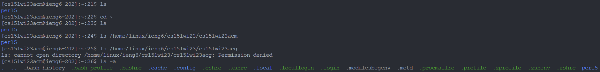

# Lab Report 1 - Remote Access and Filesystem
## Jonathan Yunawan
---
# 1. Installing VS
  
Prior to this class, I already had Visual Studio Code installed, so I did not have to go through the installation process again. I was able to download Visual Studio Code from [this](https://code.visualstudio.com/) link. I picked the correct OS which is Windows in my case, and downloaded it and followed the steps for installation. As you can see, the colors in my Visual Studio Code look slightly different, as I have downloaded a custom theme and instead of using the Windows shell for my console, I am using WSL(Windows Subsystem for Linux).

# 2. Remotely Connecting
  
During the lab, I count not connect to the server. When I tried creating a password, despite meeting all the requirements, it said that my password did not meet the requirements. Since I was unable to connect on my own laptop, I shared one with a classmate first. Near the end of the class, I was able to reset my password but I was still unable to connect to the server. I followed the instructions on [this](https://docs.google.com/document/d/1hs7CyQeh-MdUfM9uv99i8tqfneos6Y8bDU0uhn1wqho) link in order to reset my password. Something worth noting is that instead of pressing "Check Password" to reset the password, I had to press the enter key on the last field I filled in, which is the Confirm Password field. Another thing is to be careful to set the "Change MyTritonLink Password" to no and set "Change course specific account passwords" to yes.
  
After the lab, I tried connecting to the server again. I was able to successfully connect to the server with the command `ssh.exe cs15lwi23acm@ieng6.ucsd.edu`. The reason I am using "ssh.exe" instead of "ssh" is because I am not using the default terminal on Visual Studio Code but instead the fish shell.

# 3. Trying Commands 
After successfully connecting to the server, I tried out a bunch of commands.
  

The first one I tried was `ls` and it only showed one file in the current directory. I then tried going into the parent directory with `cd ~` but when I did `ls` again, it was the same directory. I then tried accessing someone else's directory but I did not have permission to do so. I then tried doing `ls -a` in my own directory and it showed a lot more files as the `-a` shows all entries and does not ignore the entries starting with `.`. 
  
I then did `ls -lat` which shows a lot more information about the items in that directory.
  
After that, I tried the `cp` command to copy a file called `hello.txt` from another directory but I did not have permission to do so. I also tried using the `cat` command on this file but I also did not have permission to do so.
  
Lastly, I terminated the connection to the server with the `exit` command.