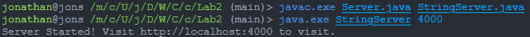
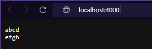
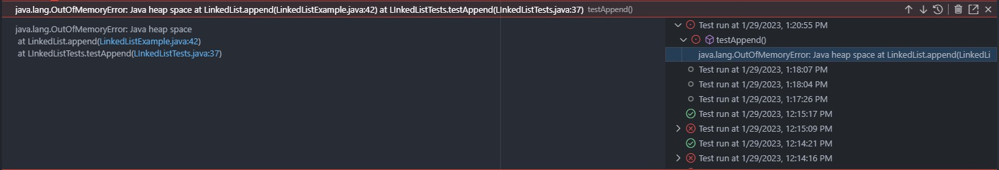

# Lab Report 2 - Servers and Bugs 
## Jonathan Yunawan
---
# 1.
Code for StringServer.java
```java
import java.io.IOException;
import java.net.URI;

class Handler implements URLHandler {
    // The one bit of state on the server: a number that will be manipulated by
    // various requests.
    String message = "";

    public String handleRequest(URI url) {
        if (url.getPath().equals("/")) {
            return message;
        } else {
            if (url.getPath().contains("/add-message")) {
                String[] parameters = url.getQuery().split("=");
                if (parameters[0].equals("s")) {
                    if (parameters[0].equals("s")) {
                        message += parameters[1] + "\n";
                        return "";
                    }
                }
            }
            return "404 Not Found!";
        }
    }
}

class StringServer {
    public static void main(String[] args) throws IOException {
        if(args.length == 0){
            System.out.println("Missing port number! Try any number between 1024 to 49151");
            return;
        }

        int port = Integer.parseInt(args[0]);

        Server.start(port, new Handler());
    }
}
```
  
  
Whenever I start a new Server, the main method in the StringServer class is called. It takes the port of the server through the main method's args variable and starts a server with that port and a handler of the Handler class I made.   
  
  
I then put in this link ```http://localhost:4000/add-message?s=abcd``` and the this is what is shown. What happened was the handleRequest method in the Handler class was called. It then passes the URI as a parameter. It then checks what is in the path. It does not detect that it is just ```/``` so it then checks if it contains ```/add-message```, which it does. It then checks the query, or what is after the ```?```. The parameters variable will have 2 entries. The one at index ```0``` will be ```s```, and the one at index ```1``` will be ```abcd```. It then checks if the one at index ```0``` is ```s```, which it is so it goes forward and adds ```abcd\n``` to the message variable. This causes it to contain the message and a line break for the next time ```add-message``` is successfully called. It then returns an empty string since the method requires us to return a String. After that, I put in the link ```http://localhost:4000/``` to display the results seen above. The code runs again inputting the URI and then it checks if the path is just ```/```, which it is so it returns the message variable. 
  

The second link I put in is ```http://localhost:4000/add-message?str=efgh``` and this is waht is shown. The handleRequest method in the Handler class was called again, and the URI is passed as a parameter. It checks the path which in this case contains ```add-message```, so it splits the parameters with index ```0``` being ```str``` and index ```1``` being ```efgh```. It then checks if the index ```0``` of parameters is ```s```, which it isn't, so it returns the message ```404 Not Found!```.  
  
# 2.
One of the examples for a buggy program I found interesting is the LinkedListExample. We had to look for errors on our own, and we didn't know where they were, so we have to check each one without knowing if there is necessarily an error there. Although I might be wrong, the only place I found an error for this was in the append method.  

  
The reason this image looks different from the terminal is that it isn't. It uses Visual Studio Code's built in feature to run tests, and makes testing much more convenient. In order to run tests normally though, we would first compile them with:  
```javac -cp ".;lib/hamcrest-core-1.3.jar;lib/junit-4.13.2.jar" *.java```  
Then we would run the test with:  
```java -cp ".;lib/junit-4.13.2.jar;lib/hamcrest-core-1.3.jar" org.junit.runner.JUnitCore LinkedListExample```  
where in this case, LinkedListExample is the name of the file.
  
Failure inducing input: non-empty array with more than one entry such as ```[1,2]``` and any integer parameter ```value``` such as ```1```  
Non-failure inducing input: empty array or array with only one entry such as ```[]``` or ```[0]``` and any integer value for the ```value``` parameter such as ```1```   
Symptom: OutOfMemoryError due to an infinite loop
Bug: It constantly changes the value of the next node in the loop, so the next node will never be ```null```. This causes an infinite loop.  
Fix: A fix is to put the code to change the next node outside of the while loop, so it only changes it once the next value is ```null``` meaning it reaches the end of the list. This causes it to only append the value to the list after it reaches the end of the list.  
  
Original Code:  
```java
public void append(int value) {
        if(this.root == null) {
            this.root = new Node(value, null);
            return;
        }
        // If it's just one element, add if after that one
        Node n = this.root;
        if(n.next == null) {
            n.next = new Node(value, null);
            return;
        }
        // Otherwise, loop until the end and add at the end with a null
        while(n.next != null) {
            n = n.next;
            n.next = new Node(value, null);
        }
    }
```  
  
Edited Code:  
```java
public void append(int value) {
        if(this.root == null) {
            this.root = new Node(value, null);
            return;
        }
        // If it's just one element, add if after that one
        Node n = this.root;
        if(n.next == null) {
            n.next = new Node(value, null);
            return;
        }
        // Otherwise, loop until the end and add at the end with a null
        while(n.next != null) {
            n = n.next;
        }

        n.next = new Node(value, null);
    }
```  
  
Tests used:  
```java
    @Test
    public void testAppendEmpty() {
        LinkedList list = new LinkedList();
        list.append(0);
        assertEquals(0, list.root.value);
    }

    @Test
    public void testAppendOne() {
        LinkedList list = new LinkedList();
        Node n = new Node(0, null);
        list.root = n;
        list.append(1);
        assertEquals(1, list.root.next.value);
    }

    @Test
    public void testAppend() {
        LinkedList list = new LinkedList();
        Node n = new Node(0, null);
        Node n1 = new Node(1, null);
        list.root = n;
        list.root.next = n1;
        list.append(2);
        assertEquals(2, list.root.next.next.value);
    }
```  
  
# 3.
A couple interesting things I learned from Lab 2 and 3 is how to make and run a web server. It was a much easier process than I imagined, especially with the Server file already provided to us, all we had to do was create a class to handle the requests. Another interesting thing is automated testing. Although I knew slightly about this before, I learned more about how to test properly, to look for the failure inducing inputs, the symptom, the bug. This makes fixing whatever bug much easier when we know what goes wrong and why it goes wrong.