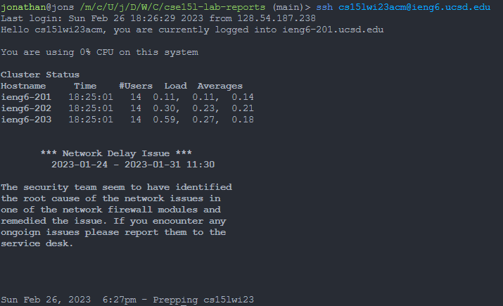
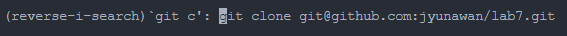
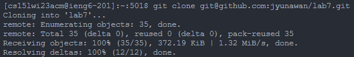
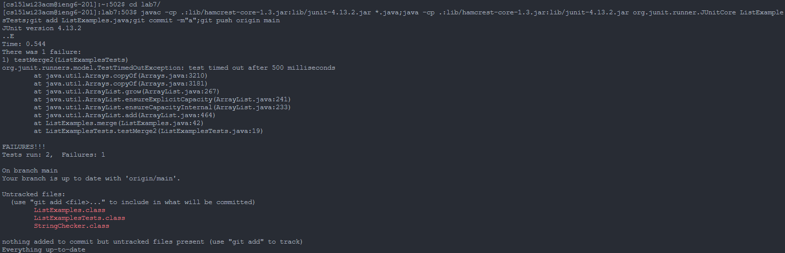
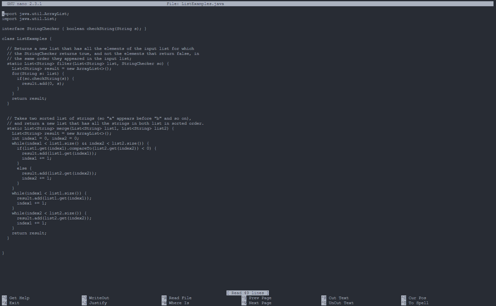
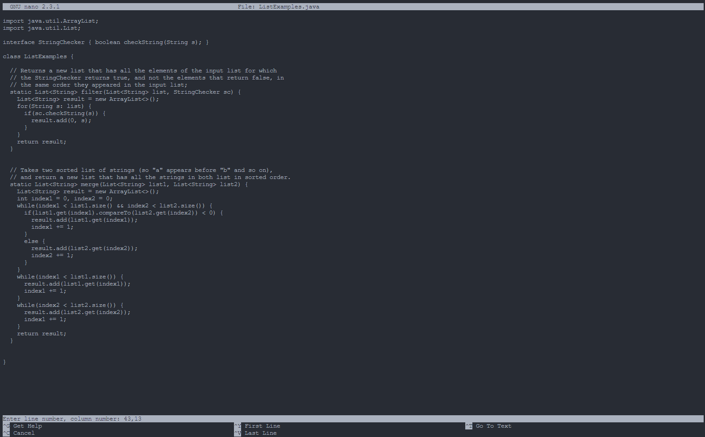
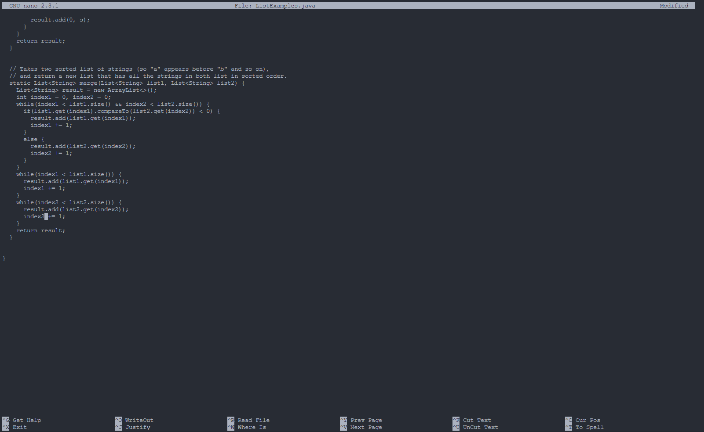

# Lab Report 4
## Jonathan Yunawan
---
### Step 4 : Log into ieng6  
Keys Pressed : `<up><enter>`  
The ssh command was 1 up in the search history, so I used the up arrow in order to get to it and run it.  
  
  

### Step 5 : Clone your fork of the repository from your Github account  
Keys Pressed : `<ctrl-r>, "git c", <enter>`  
I then cloned the repository, by using `<ctrl-r>` to look up a command I had previously used.  
  
After that, I pressed <enter> to run the command.  
  
  

### Step 6 : Run the tests, demonstrating that they fail  
Keys Pressed : `"cd l", <tab><enter><ctrl-v><enter>`  
I then change into the lab7 directory, and run ```javac -cp .:lib/hamcrest-core-1.3.jar:lib/junit-4.13.2.jar *.java;java -cp .:lib/hamcrest-core-1.3.jar:lib/junit-4.13.2.jar org.junit.runner.JUnitCore ListExamplesTests;git add ListExamples.java;git commit -m"a";git push origin main```, which is what I have in my clipboard for later purposes as well. The git parts of this command will not run as no changes have been made yet to the file.  
  
  
  
### Step 7 : Edit the code file to fix the failing test  
Keys Pressed : `"nano L", <tab>, ".j", <tab><enter>, <ctrl-w><ctrl-t>, "43,13", <enter><backspace>, "2", <ctrl-o><enter><ctrl-x>`  
I first do ```nano ListExamples.java``` to open the file.  
  
I then use two shortcuts, `<ctrl-w>`, which looks things up in the file. Then I do `<ctrl-t>`, which gives me the ability to look up based on line and column number. The numbers 43 and 13 are where I have found the error to be.  
  
After that, I edited the file, saved, and closed it.

  
  
### Steps 8 & 9 : Run the tests, demonstrating that they now succeed; Commit and push the resulting change to your Github account (you can pick any commit message!)  
Keys Pressed : `<ctrl-v>`  
I then run the same command as in step 7, ```javac -cp .:lib/hamcrest-core-1.3.jar:lib/junit-4.13.2.jar *.java;java -cp .:lib/hamcrest-core-1.3.jar:lib/junit-4.13.2.jar org.junit.runner.JUnitCore ListExamplesTests;git add ListExamples.java;git commit -m"a";git push origin main```, which now compiles the file, runs the test, and adds the file, commits it and pushes it onto the github.  
  
  
### Conclusion  
Although I have done many tricks here, most of it won't be as useful in actual scenarios as some of it, especially the really long command, will require preparation beforehand. Something useful I found though, is ctrl-r, which allows me to search previous commands, and of course the trusty up arrow which I have been using for a long time. I was able to reach a best time of 35 seconds and an average of 40 seconds this way.
